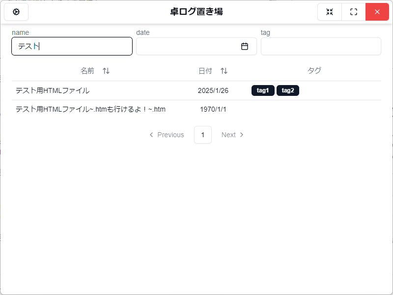
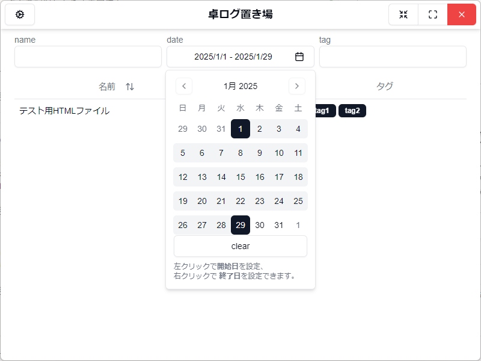
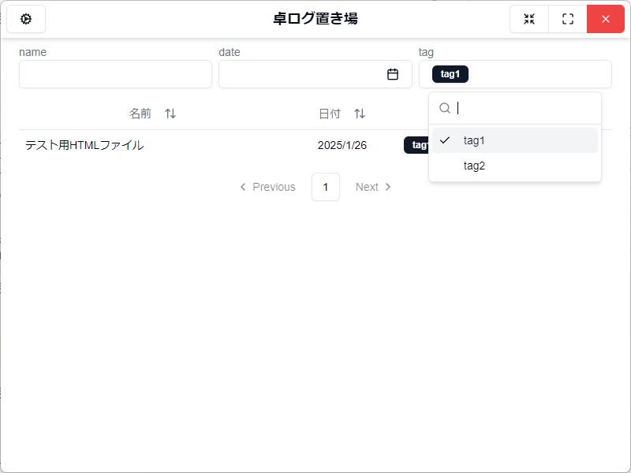
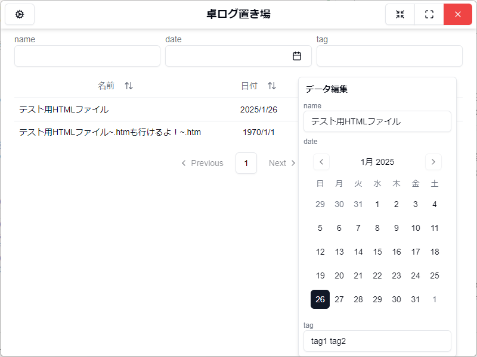
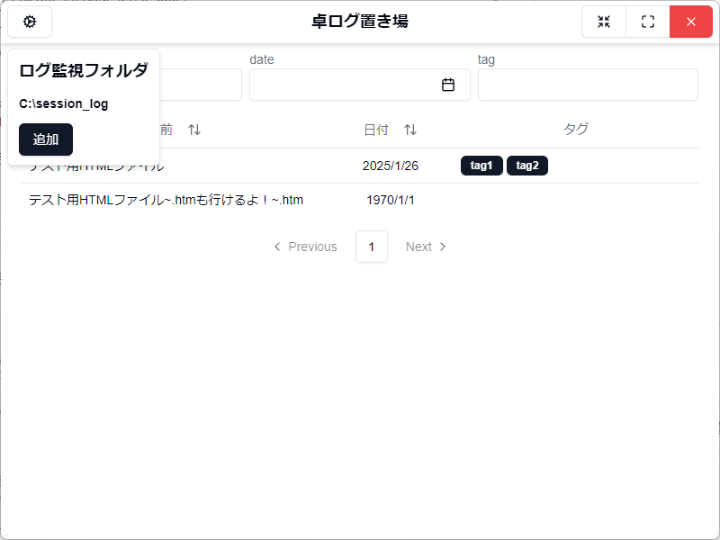

# 卓ログ置き場

## 概要

TRPG のセッションログなどの html ファイルを管理閲覧するための windows デスクトップアプリ。  
複数フォルダのセッションログを一覧表示したり、並び変えたり、絞り込んだり、名前・日付・タグを記録したり。

## 機能

### ログ一覧画面

ログファイルを表形式で一覧表示します。  
表のヘッダーをクリックすると名前か日付でソートが行えます。  
再度クリックすると昇順と降順を切り替えられます。

#### 絞り込み機能

表の上の入力欄から、一覧のデータを絞り込む事ができます。

- 名前を空白区切り・部分一致で検索
- 日付を範囲指定で検索
- タグを複数指定・完全一致で検索

#### 編集機能

一覧の行を右クリックで、編集用のコンテキストメニューが開かれます。  
変更内容を入力するとデータが更新されます。  
（並びは現在の表示順のままなので、ソートを行う場合はカラムヘッダーを再度クリックする必要あり。）

> [!TIP]
> データの編集はhtmlファイルそのものを操作するのではなく、htmlファイルが置かれているフォルダに「modifier.json」という設定ファイルを作成して読み込んでいます。  
> テキストディタ等での編集を行うと予期せぬエラーが発生する恐れがあります。どうしようもなくなった場合は削除してください。

### ログ監視フォルダの設定

ログファイルを収めるフォルダを設定します。  
画面左上の歯車マークのボタンをクリックすると監視するフォルダが一覧で表示されます。  
追加ボタンで開くダイアログからフォルダを選択すれば、新たに登録することができます。

> [!NOTE]
> 機能が不十分です。  
> 現バージョンでは監視フォルダを削除したい場合は、AppDataフォルダにある「卓ログ置き場」フォルダ内のsetting.jsonからお願いします。

### ログ閲覧画面

ログ一覧画面の表からクリックでログ閲覧画面に遷移します。  
ログの中身が（ちょっぴり整形されて）表示され、閲覧することができます。

***

## 今後の実装予定

- ログ監視フォルダの設定
  - 設定したフォルダの削除機能  
    現在は user\AppData\Roaming\卓ログ置き場\setting.json からしか編集できません(´・ω・`)
- ログ閲覧画面
  - メイン、情報、雑談の表示差分化
  - どこまで読んだかのブックマーク機能

## 更新履歴

- **v1.1.0** (2025-01-26)
  - ログ一覧画面の機能追加
    - 表示データ編集機能を追加。
    - ソート・フィルタリング機能追加。
    - ページネーションも追加。
- **v1.0.1** (2025-01-16)
  - 作成を忘れてた readme を追加
  - ログ閲覧画面で改行後の文章が消えてしまうバグ修正
- **v1.0.0** (2025-01-16)
  - ログ管理アプリ「卓ログ置き場」リリース！
