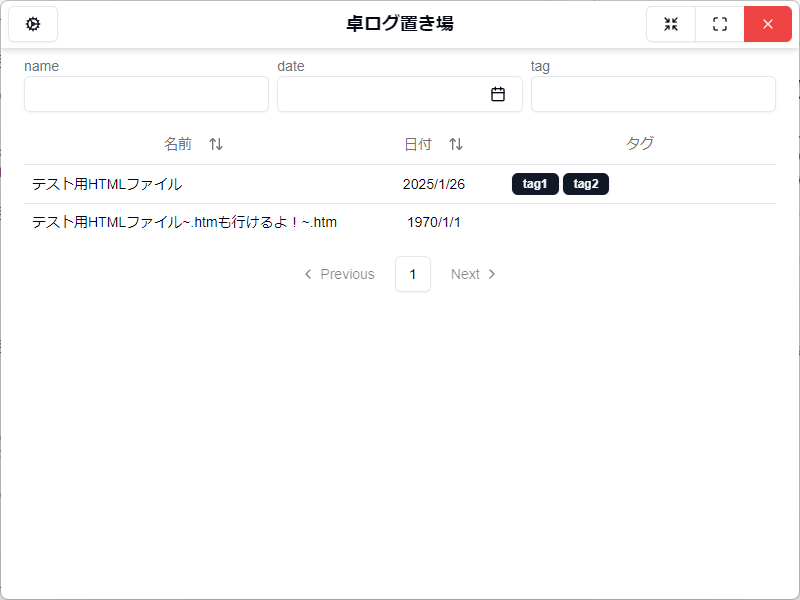
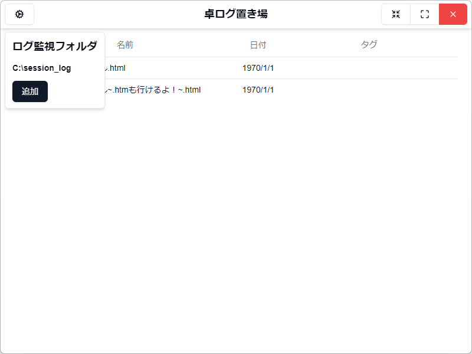
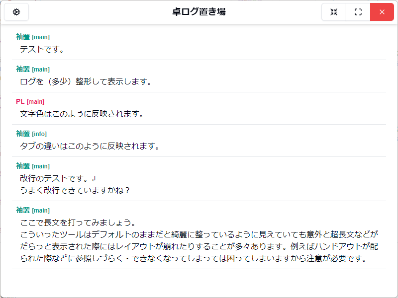

# 卓ログ置き場

## 概要

TRPGのセッションログなどのhtmlファイルを管理閲覧するためのwindowsデスクトップアプリ。  
複数フォルダのセッションログを一覧表示したり、並び変えたり（未実装）、絞り込んだり（未実装）、名前・日付・タグを記録したり（未実装）。

## 機能

### ログ一覧画面

ログファイルを表形式で一覧表示します。

### ログ監視フォルダの設定

ログファイルを収めるフォルダを設定します。  
画面左上の歯車マークのボタンをクリックすると監視するフォルダが一覧で表示されます。  
追加ボタンで開くダイアログからフォルダを選択すれば、新たに登録することができます。

### ログ閲覧画面

ログ一覧画面の表からクリックでログ閲覧画面に遷移します。
ログの中身が（ちょっぴり整形されて）表示され、閲覧することができます。

## 今後の実装予定

- ログ一覧画面
  - 名前や日時、タグの編集
  - 名前や日時での並び替え
- ログ監視フォルダの設定
  - 設定したフォルダの削除機能  
    現在はuser\AppData\Roaming\卓ログ置き場\setting.jsonからしか編集できません(´・ω・`)
- ログ閲覧画面
  - メイン、情報、雑談の表示差分化
  - どこまで読んだかのブックマーク機能

## 更新履歴

- **v1.0.1** (2025-01-16)  
  - 作成を忘れてたreadmeを追加
  - ログ閲覧画面で改行後の文章が消えてしまうバグ修正
- **v1.0.0** (2025-01-16)  
  - ログ管理アプリ「卓ログ置き場」リリース！
