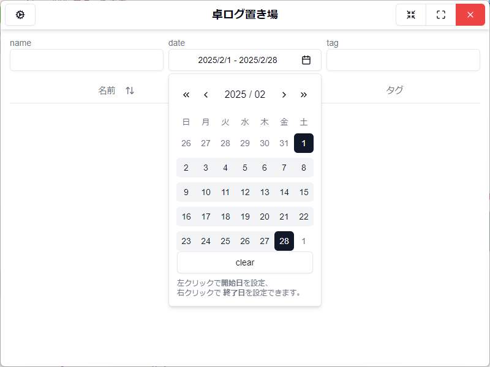
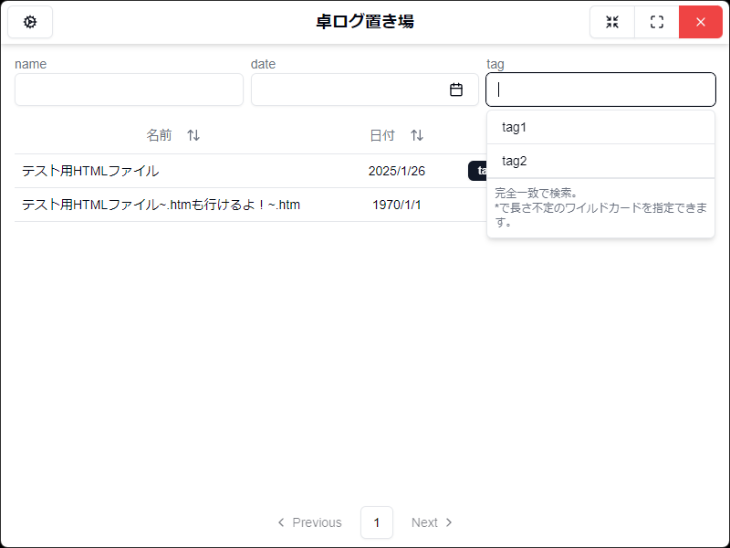
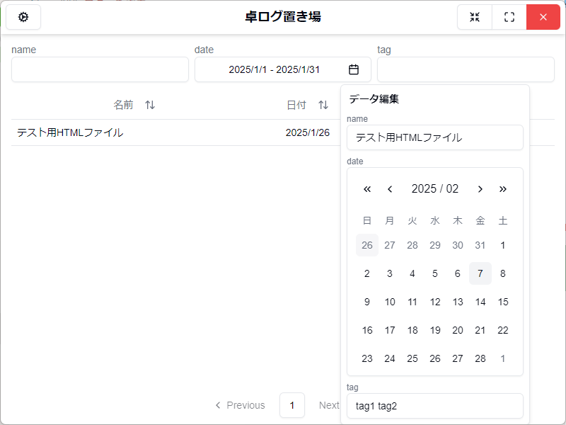

# 卓ログ置き場

## 概要

TRPG のセッションログなどの html ファイルを閲覧・管理するための windows デスクトップアプリ。

複数フォルダのセッションログを  
一覧表示したり、  
並び変えたり、  
絞り込んだり、  
名前・日付・タグを記録したりできます。

## インストール

release から最新版をダウンロードしてください。  
ファイルは zip 形式なので任意の場所で解凍し、中にある「卓ログ置き場.exe」を実行すれば使用できます。

### アンインストール

インストール時に展開したファイルを削除してください。  
`Users\(username)\AppData\Roaming\卓ログ置き場\`に設定ファイルなどがあるため、気になる方は削除してください。

## リンク

なにかあればこちらまで。  

---

## 機能

### ログ一覧画面

ログファイルを表形式で一覧表示します。  
表のヘッダーをクリックすると名前か日付でソートが行えます。  
再度クリックすると昇順と降順を切り替えられます。

  

#### 絞り込み機能

表の上の入力欄から、一覧のデータを絞り込む事ができます。

- 名前を空白区切り・部分一致で検索
- 日付を範囲指定で検索
- タグを空白区切り完全一致（\*:ワイルドカード）で検索

    
    
    

#### 編集機能

一覧の行を右クリックで、編集用のコンテキストメニューが開かれます。  
変更内容を入力するとデータが更新されます。  
（並びは現在の表示順のままなので、ソートを行う場合はカラムヘッダーを再度クリックする必要あり。）

> [!TIP]
> データの編集は html ファイルそのものを操作するのではなく、html ファイルが置かれているフォルダに「modifier.json」という設定ファイルを作成して読み込んでいます。  
> テキストディタ等での編集を行うと予期せぬエラーが発生する恐れがあります。どうしようもなくなった場合は削除してください。

  

### ログ監視フォルダの設定

ログファイルを収めるフォルダを設定します。  
画面左上の歯車マークのボタンをクリックすると監視するフォルダが一覧で表示されます。  
追加ボタンで開くダイアログからフォルダを選択すれば、新たに登録することができます。  
ゴミ箱ボタンで監視から外すことができます。

> [!TIP]
> 監視を外しても設定ファイル(modifier.json)は削除されません。必要に応じて削除してください。

  

### ログ閲覧画面

ログ一覧画面の表からクリックでログ閲覧画面に遷移します。  
ログの中身が（ちょっぴり整形されて）表示され、閲覧することができます。

画面右上の「>」ボタンからタブ設定画面を開くことができ、各タブの表示を自身で設定できます。  
「カラー」のみ背景色も設定可能です。  
（設定しなくてもある程度は見やすくなっているはず。）

  
  
  

### ローカル保存

本アプリは基本的に Windows 向けのデスクトップアプリですが、スマートフォンなどでも閲覧できるようにローカルの HTML ファイルとして出力する機能を備えています。  
ただし、あくまで補助的な機能です。デスクトップアプリの機能はほぼなく成形済みファイルが閲覧できるのみとなります。  
ファイルは`Users\(username)\AppData\Roaming\卓ログ置き場\logfile`に「(ログ名).html」保存されます。同名のログは上書き保存されます。

---

## 今後の実装予定

- ログ閲覧画面
  - どこまで読んだかのブックマーク機能

## 更新履歴

- **v1.3.1** (2025-03-19)
  - ログ一覧画面
    - ページネーションの改修
      - 無駄な省略部分を削除し、ページ遷移をより便利に
    - 検索動作の改修
      - タグ検索時に空欄にしても全てのデータが表示されないのを修正
    - UI 改善
      - 監視ディレクトリ表示を改良
  - ログ閲覧画面
    - UI 改善
      - ログ閲覧の文字サイズ調整
      - カラーでのタブ名表示
  - その他
    - modifier.json 読み込み書き込み周りの修正
      - modifier.json がない時の作成処理
      - modifier.json のバージョンチェックミスの修正
    - その他動作の安定化
- **v1.3.0** (2025-03-19)
  - ログ一覧画面
    - タグ検索のリメイク
      - マルチプルのセレクトボックスではなく、テキスト入力に
  - ログ閲覧画面
    - タブ表示の設定機能追加
      - タブごとの表示方法をユーザー側でも変更可能に
      - 選択できるタブ表示に背景色を自由に指定できる「カラー」を追加
  - ローカル保存
    - ログ閲覧画面をローカルにも保存する機能追加(スマホなどで見ることを想定)
  - README の更新
    - バッジとか、連絡先とか
- **v1.2.0** (2025-02-07)
  - ログ閲覧画面
    - メイン、情報、雑談、その他のタブ・パラメータ変更の際の表示を分別
  - 監視フォルダ
    - 監視フォルダの削除を実装
  - ログ一覧の UI 改善
    - 検索・編集の日付入力で年単位のカレンダー移動を可能に
    - ページネーションのボタン位置を固定
    - デフォルトの並び順を新しい順に
  - その他修正など
    - 全ページに読み込み時の表示を追加
    - スクロールバーの表示実装
    - 一覧画面の表がタグの有無で行高が変わるのを修正
- **v1.1.0** (2025-01-26)
  - ログ一覧画面の機能追加
    - 表示データ編集機能を追加。
    - ソート・フィルタリング機能追加。
    - ページネーションも追加。
- **v1.0.1** (2025-01-16)
  - 作成を忘れてた readme を追加
  - ログ閲覧画面で改行後の文章が消えてしまうバグ修正
- **v1.0.0** (2025-01-16)
  - ログ管理アプリ「卓ログ置き場」リリース！
